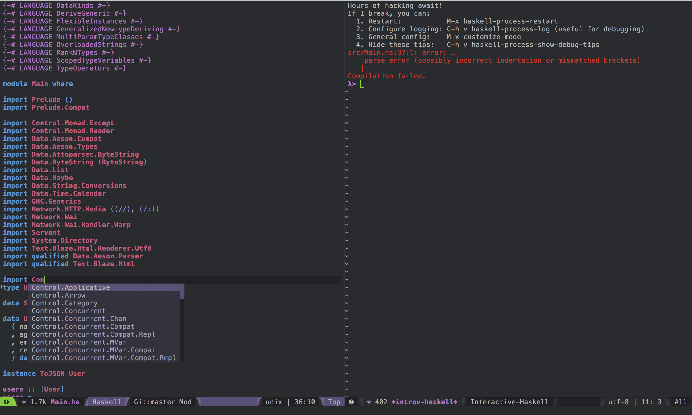

created using [`cabal init`](https://www.haskell.org/cabal/users-guide/developing-packages.html)

```
$ ghc --version
The Glorious Glasgow Haskell Compilation System, version 8.2.1
```

```
# use cabal help to understand cabal commands

$ cabal install
Warning: --root-cmd is no longer supported, see
https://github.com/haskell/cabal/issues/3353 (if you didn't type --root-cmd,
comment out root-cmd in your ~/.cabal/config file)
Warning: The package list for 'hackage.haskell.org' is 21 days old.
Run 'cabal update' to get the latest list of available packages.
Resolving dependencies...
Configuring introv-haskell-0.1.0.0...
Building introv-haskell-0.1.0.0...
Installed introv-haskell-0.1.0.0
Updating documentation index
/Users/prayagupd/Library/Haskell/share/doc/x86_64-osx-ghc-8.2.1/index.html

$ cabal run
Preprocessing executable 'introv-haskell' for introv-haskell-0.1.0.0..
Building executable 'introv-haskell' for introv-haskell-0.1.0.0..
Running introv-haskell...
Hello, Haskell!
```

where do packages live?
-------------------------

```
$ ll ~/.cabal/packages/hackage.haskell.org/servant/0.15/
total 88
-rw-r--r--  1 prayagupd  184630988  44653 Nov 22 13:28 servant-0.15.tar.gz
```

run application
----------------

```
cabal run


$ curl -v localhost:8081/users
*   Trying ::1...
* TCP_NODELAY set
* Connection failed
* connect to ::1 port 8081 failed: Connection refused
*   Trying 127.0.0.1...
* TCP_NODELAY set
* Connected to localhost (127.0.0.1) port 8081 (#0)
> GET /users HTTP/1.1
> Host: localhost:8081
> User-Agent: curl/7.54.0
> Accept: */*
> 
< HTTP/1.1 200 OK
< Transfer-Encoding: chunked
< Date: Fri, 23 Nov 2018 01:55:21 GMT
< Server: Warp/3.2.25
< Content-Type: application/json;charset=utf-8
< 
* Connection #0 to host localhost left intact
[{"email":"isaac@newton.co.uk","registration_date":"1683-03-01","age":372,"name":"Isaac Newton"},{"email":"ae@mc2.org","registration_date":"1905-12-01","age":136,"name":"Albert Einstein"}]
```


Haskell 101:

https://github.com/prayagupd/currys-paradox.hs


